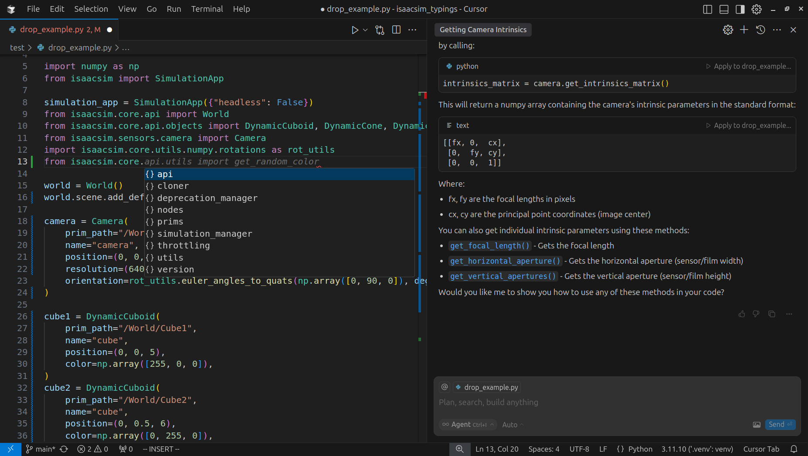

# IsaacSim Typings

Supports Isaac Sim 4.5.0

This repo contains unofficial generated stub files generated from NVIDIA's Isaacsim for use with VSCode/Cursor to enable type completion / checking and AI assitance.

> NVIDIA Isaac Sim™ is a reference application built on NVIDIA Omniverse that enables developers to develop, simulate, and test AI-driven robots in physically-based virtual environments.



Documentation for Isaac Sim itself: [Installation and Guides](https://docs.isaacsim.omniverse.nvidia.com/4.5.0/index.html), [API Documentation](https://docs.isaacsim.omniverse.nvidia.com/4.5.0/py/index.html)


## Usage

For the type stubs in this repo to be useful, VSCode/Cursor needs to be able to find them.

By default, VSCode/Cursor will look in the `./typings` folder of your project for stubs. Therefore the easiest way to use the type stubs provided here is to copy them into the `./typings` folder in your project. You may choose to add `./typings` to your `.gitignore` file.

Alternatively, you can customise where VSCode/Cursor looks for type stubs. See [settings.json](./.vscode/settings.json) for guidance on how to change this as well as https://code.visualstudio.com/docs/python/settings-reference.

You will also need to disable VSCode/Cursor's warnings about missing source files by adding the following to your editor/project/workspace `settings.json` file. We need to this because we don't have access to the module source because the stubs are generated from compiled python extensions.

```json
"python.analysis.diagnosticSeverityOverrides": {
    "reportMissingModuleSource": "none"
}
```

## Generating Stubs

If you are only looking to use the provided stub files, then you can ignore this section.

These commands will install `pybind11-stubgen` into your isaacsim python environment and then regenerate the stubs. This assumes you have installed Isaac Sim using the [Workstation Installation Instructions](https://docs.isaacsim.omniverse.nvidia.com/4.5.0/installation/install_workstation.html), other installation methods may install Isaac Sim to a different location.

```bash
~/isaacsim/python.sh -m pip install pybind11-stubgen
~/isaacsim/python.sh isaacsim_stubgen.py
```
